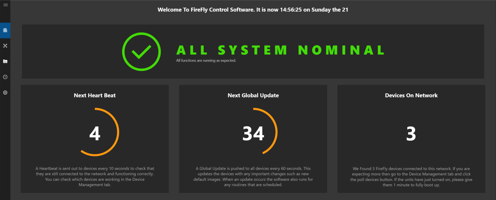
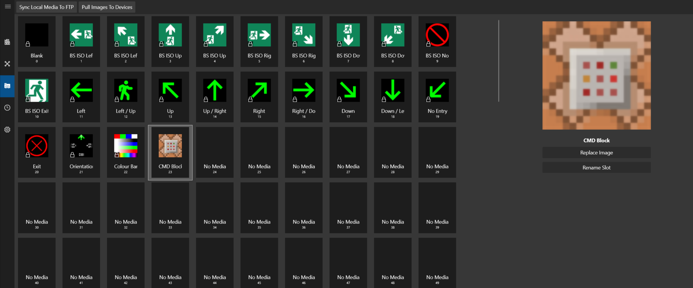
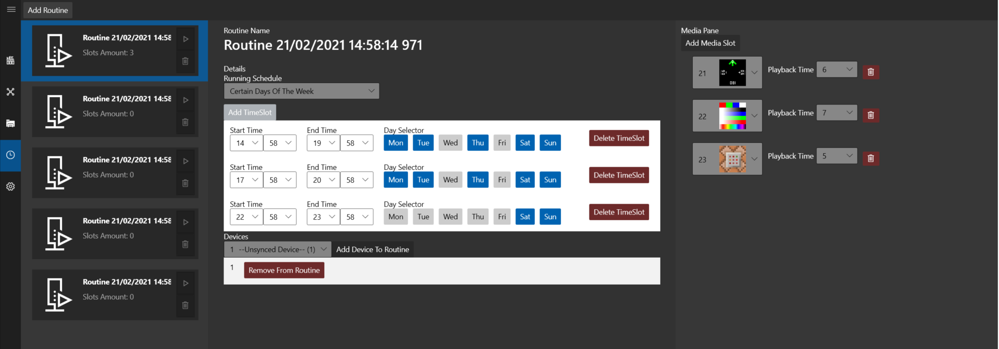

# Firefly
 
Firefly is an fire safety solution to completement / be as an additional safety measure in venues. The Firefly node is an inground node that can display safety signage, corporate logos or any images during normal use. When an evacuation procedure happens, the software will calculate the safest and shortest route to the nearest emergency exit and display the correct signage on the nodes to direct people to the exit. This could be helpful if there is alot of smoke within a room and it blocks out the emergency signage above eye level, or if people need to get onto their hands and knees to crawl. This could also be utilised in a scenario where you do not want a massive announcement for evacuation, such as a shooting.

